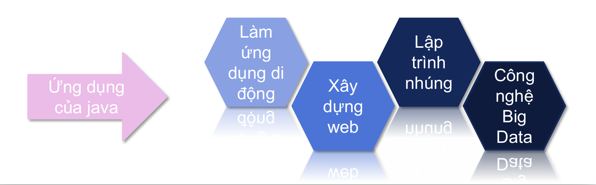
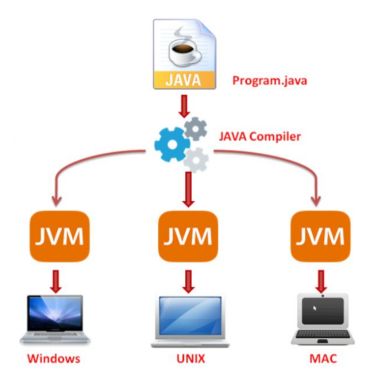
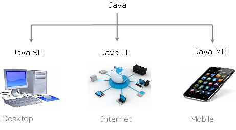

# Giới thiệu về ngôn ngữ java 
## 1. Java là gì? 
Java là một trong những ngôn ngữ lập trình hướng đối tượng phổ
biến nhất hiện nay
Nó giúp các lập trình viên phát triển các ứng dụng có thể chạy trên
nhiều thiết bị phần cứng và hệ điều hành khác nhau

  

## 2.Lịch sử phát triển  


## 3. Đặc tính của java
- Là ngôn ngữ lập trình hướng đối tượng: Các chương trình Java được xây dựng dựa trên việc thiết kế các lớp và đối tượng.  
- Đơn giản: Java được thiết kế với mục đích giúp người học dễ dàng hơn trong việc tiếp thu kiến thức. Vì vậy, nếu bạn đã hiểu cơ bản Java là gì thì khi học, các bạn có thể nắm bắt ngôn ngữ lập trình này rất nhanh.
- Độc lập nền tảng: Nột chương trình Java có thể chạy trên nhiều máy tính khác nhau (Windows, Unix, Linux,...) với điều kiện ở đó có cài đặt JVM 
- Khả chuyển: Chương trình ứng dụng viết bằng ngôn ngữ Java chỉ cần được chạy trên JVM là có thể chạy được trên bất kỳ máy tính, hệ điều hành nào có JVM. *Write Once, Run Anywhere - Viết một lần, chạy mọi nơi*  
- Đa nhiệm, đa luồng: Java hỗ trợ đa nhiệm, đa luồng cho phép nhiều tiến trình, tiểu trình có thể chạy song song cùng một thời điểm và tương tác với nhau  
- An toàn: Code luôn được kiểm tra trước khi thực thi, có nhiều mức độ bảo mật -> Môi trường thực thi an toàn  
  
## 4. JVM và bytecode
- Máy ảo java (JVM - Java Virtual Machine) là một máy ảo cho phép chạy các chương trình Java cùng như các chương trình khác viết bằng ngôn ngữ khác mà được biên dịch sang mã máy  
- Ngôn ngữ dành cho máy ảo Java được gọi là java bytecode, hay ngắn gọn là bytecode  

  

## 5. Các nền tảng Java

**Java Platform** (nền tảng Java) là một tập hợp các chương trình giúp phát triển và chạy các chương trình được viết bằng ngôn ngữ lập trình Java.  

**Java Platform** bao gồm một công cụ thực thi (execution engine), trình biên dịch (compiler) và một bộ thư viện Java.
 
  


**Các nền tảng java:**  
- Java Standard Edition (Java SE): Là nền tảng cơ bản cho phép phát triển giao diện điều khỉển, các ứng dụng mạng và các ứng dụng dạng winform  
- Java Enterprise Edition (java EE): Được xây dụng trên nền tảng Java SE, giúp phát triển các ứng dụng web, các ứng dụng ở cấp doanh nghiệp  
- Java Mobile Edition (Java ME): Là nền tảng cho phép phát triển các ứng dụng nhúng vào các thiết bị điện tử như mobile,...


## 6. Cấu trúc của chương trình Java  

```java
package <package_name>;
import <other_package>;

public class <class_name>{
    <variables>;
    <methods>;
}
```
Trong đó:
- `package`: Một package (gói) mô tả không gian tên có chứa các lớp của java, ta có thể xem package như một thư mục  
- `import`: Nhằm sử dụng để xác định các class hoặc package được sử dụng trong lớp này  
- `public`: Xác định phạm vi truy cập của lớp
- `class`: Từ khóa nhằm định nghĩa lớp của java
- `variables`: Biến
- `methods`: Phương thức


