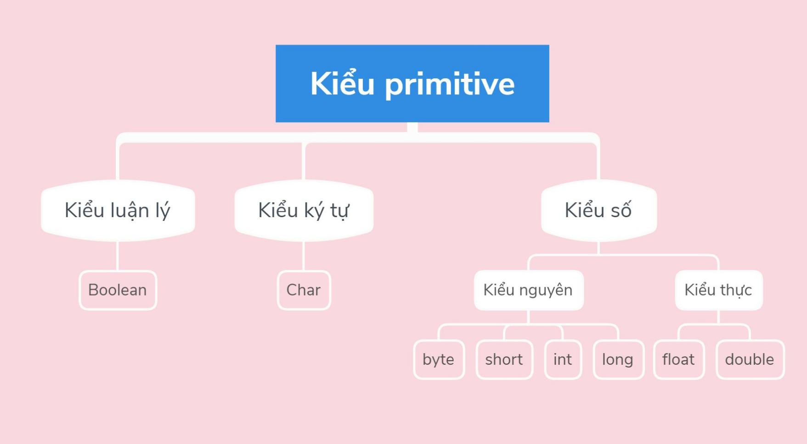
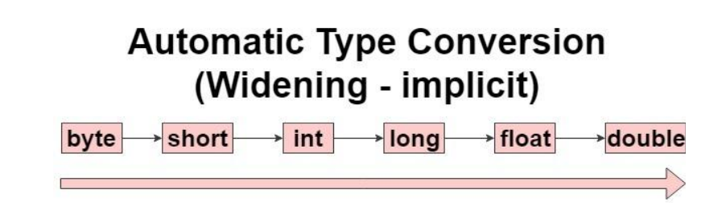
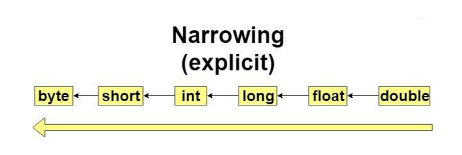

## Biến
Biến là vùng nhớ dùng để lưu trữ các giá trị của chương trình. Mỗi biến gắn liền với một kiểu dữ liệu và một định danh duy nhất gọi là tên biến    
Cú pháp khai báo biến:   
`<Kiểu dữ liệu> <Tên biến>;`

Gán giá trị cho biến:  
`<Tên biến> = <Giá trị>;`

**Các loại biến:**  
- Biến toàn cục: Biến có thể truy xuất ở khắp nơi trong chương trình, thường được khai báo dùng từ khóa public, hoặc đặt chúng trong một class    
- Biến cục bộ: Biến chỉ có thể truy xuất trong khối lệnh nó khai báo  

```java
public class Variable {
    public int globalVariable; // Biến toàn cục
    public static void main(String[] args){
        int localVariable; //Biến cục bộ
    }
}
```

## Kiểu dữ liệu  
Kiểu dữ liệu trong Java gồm 2 loại:  

### 1. Các kiểu dữ liệu nguyên thủy (Primitive Types)  
  

**Kiểu số nguyên:** Java cung cấp 4 kiểu số nguyên khác nhau là `byte`, `short`, `int`, `long`  

| Kiểu dữ liệu | Miền giá trị | Giá trị mặc định | Kích cỡ mặc đinh |  
| --- | --- | --- | --- |
| byte | -128 đến 127 | 0 | 1 byte |
| short | -32768 đến 32767 | 0 | 2 byte |  
| int | $-2^{31}$ đến $2^{31}-1$ | 0 | 4 byte |
| long | $-2^{63}$ đến $2^{63}-1$ | 0L | 8 byte |  


Ví dụ : 
```java
int age; 
age = 35;
long salary = 4000000L;
```

**Kiểu số thực:** Đối với kiểu số thực, Java hỗ trợ hai kiểu dữ liệu là `float` và `double`. Kiểu số thực không có giá trị nhỏ nhất và giá trị lớn nhất  

| Kiểu dữ liệu | Giá trị mặc định | Kích cỡ mặc định |  
| --- | --- | --- |
| float | 0.0f | 4 byte |  
| double | 0.0d | 8 byte |

Ví dụ:  
```java
float weight;  
weight = 40f;
double height = 1.6; //Vì double là kiểu mặc định cho kiểu số thực, nên có thể viết gọn hơn
```

**Kiểu ký tự**  
Kiểu ký tự trong Java có kích thước là 2 byte và chỉ dùng để biếu diễn các ký tự trong bộ mã Unicode. Như vậy `char` trong Java có thể biểu diễn tất cả $2^{16} = 65536$ ký tự khác nhau  
Giá trị mặc định cho một biến kiểu `char` là `null`  
Giá trị nhỏ nhát của một biến kiểu ký tự là 0 và giá trị lớn nhất là 65535  

Ví dụ:  
```java
char a = 'a';
char b = '5';
char c = 65; //theo bảng mã ASCII c == 'A'
```


**Kiểu luận lý**  
Kiểu `boolean` chỉ nhận 1 trong 2 giá trị: `true` hoặc `false`.  
Kiểu `boolean` không thể chuyển thành kiểu nguyên và ngược lại   
Giá trị mặc định của kiểu `boolean` là `false`  

Ví dụ:  
```java
boolean isCheck = true;
boolean isContinue = false;
```


### 3. Kiểu tham chiếu (References types)  
Kiểu dữ liệu tham chiếu là kiểu dữ liệu của đối tượng.  
Một số kiểu dữ liệu cụ thể như mảng (Array), lớp đối tượng (Class), Interface, String,...  


## Ép kiểu  
Ép kiểu là cách chuyển đổi kiểu dữ liệu này thành biến thuộc kiểu dữ liệu khác  
***Ý nghĩa:***  
- Việc chuyển kiểu dữ liệu sẽ đến lúc phải cần trong quá trình xử lý chương trình  
- Có thể định dạng đúng kiểu dữ liệu mình mong muốn  

***Các cách ép kiểu dữ liệu nguyên thủy***: Có 2 cách để ép kiểu:  

**1, Chuyển đổi kiểu ngầm định**  
Việc chuyển đổi sẽ tự thực hiện bởi compiler và chúng ta không cần làm gì. Việc chuyển đổi này chỉ dành cho kiểu dữ liệu nhỏ sang kiểu dữ liệu lớn hơn. Ta có thể xem chiều từ nhỏ sang lớn như sau:    
  


Ví dụ:  
```java
int a = 5;
long b = a;
System.out.println(b);
```

**2, Kiểu chuyển đổi tường minh**  
Ngược lại với chuyển đổi ngầm định, việc chuyển đổi tường minh là chiều ngược lại từ dữ liệu lớn hơn sang kiểu dữ liệu nhỏ hơn. Tuy nhiên với kiểu chuyển đổi này có thể gây ra mất mát dữ liệu  

  

Ví dụ:  
```java
long a = 6;
int b = (int) a;
System.out.println(b);
```

Với ví dụ sau sẽ gây mất dữ liệu:  
```java
double height = 1.7;
int h = (int) height;
System.out.println(h);
``` 
Ở kết quả trả về bạn sẽ thấy mất mát dữ liệu:   
```
1
```


