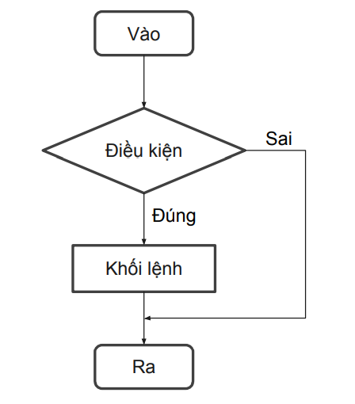
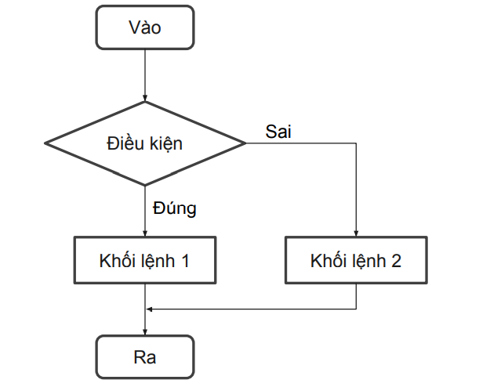

# Câu điều kiện
Như cái tên đã cho thấy, câu điều kiện là câu lệnh sẽ quyết định câu lệnh nào được thực thi. Có hai loại câu điều kiện trong Java: 

## if statement 
Trong Java, câu lệnh `if` được sử dụng để đánh giá một điều kiện. Việc chương trình được chuyển hướng tùy thuộc vào điều kiện cụ thể. Điều kiện của câu lệnh `if` cung cấp giá trị `boolean`, `true` hoặc `false`. Hãy cùng xem một số dạng của câu lệnh `if`:  

### Câu lệnh if cơ bản  
Đây là dạng cơ bản nhất trong số các lệnh điều khiển.   
Cú pháp:  
```java
if(<Điều kiện>){
    <Khối lệnh>;
}
```

  

Ví dụ:
```java
int age = 19;
if(age >= 18){
    System.out.println("Đủ tuổi bầu cử");
}
System.out.println("Tạm biệt!!!");
```

### Câu lệnh if else 

Câu lệnh `if-else` là phần mở rộng của câu lệnh `if`, nó bổ sung thêm khối `else`. Khối `else` sẽ thực thi nếu điều kiện của `if` trả về `false` (Điều kiện sai)  

Cú pháp:  
```java
if(<Điều kiện>){
    <Khối lệnh 1>;
}else{
    <Khối lệnh 2>;
}
```

  

Ví dụ:  
```java
int age = 15;
if(age >= 18){
    System.out.println("Đủ tuổi bầu cử");
}else{
    System.out.println("Rất tiếc bạn chưa đủ tuổi");
}
System.out.println("Tạm biệt!!!");
```

### Câu lệnh if else if 
Câu lệnh `if else if` chứa câu lệnh `if` theo sau là nhiều câu lệnh `else if`. 
Cú pháp:  
```java
if (<Điều kiện 1>){
    <Khối lệnh 1>;
}else if(<Điều kiện 2>){
    <Khối lệnh 2>;
}else {
    <Khối lệnh 3>;
}
```

Ví dụ:  
```java
double point = 4;

if(point >= 8){
    System.out.println("Xếp loại giỏi");
}else if(point < 8 && point>= 6.5){
    System.out.println("Xếp loại khá");
}else if(point < 6.5 && point >= 5){
    System.out.println("Xếp loại trung bình");
}else {
    System.out.println("Xếp loại yếu");
}
```

### Câu lệnh if else lồng nhau  
Trong các câu lệnh `if else`, khối `if` có thể chứa một câu lệnh `if` hoặc `if else` bên trong .    
Cú pháp:  
```java
if(<Điều kiện 1>){
    <Khối lệnh 1>;
    if(<Điều kiện 2>){
        <Khối lệnh 2>
    }
}else{
    <Khối lệnh 3>;
}
```

Ví dụ:  
```java
int a = 21;
int b = 9;
int c = 10;

if(a > b){
    if(a > c){
        System.out.println(a +" là số lớn nhất");
    }else{
        System.out.println(c + " là số lớn nhất");
    }
}else{
    if(b > c){
        System.out.println(b + " là số lớn nhất");
    }else {
        System.out.println(c + " là số lớn nhất");
    }
}
```