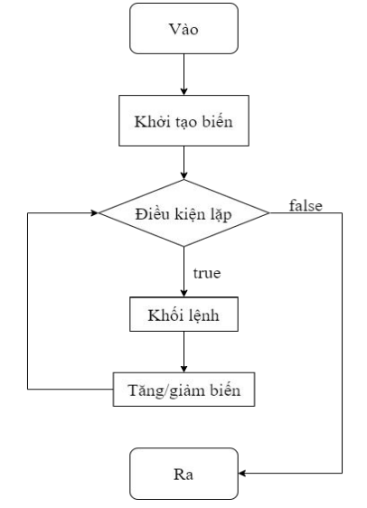

## Vòng lặp trong Java
Trong lập trình, vòng lắp được sử dụng một cách thường xuyên và mục đích là để thực thi nhiều lần một đoạn chương trình.  
Java hỗ trợ 3 loại vòng lặp khác nhau:  
- Vòng lặp `for`
- Vòng lắp `while`
- Vòng lắp `do-while`  

Ngoài ra còn có `for each` được thêm vào từ phiên bản `Java 5` sử dụng để duyệt mảng hoặc collection  

## Vòng lắp for  
Cú pháp:  
```java
for(<Khởi tạo biến>; <Điều kiện>; <Tăng/giảm biến>){
    <Khối lệnh>;
}
```


  

Trong đó:
- Bước khởi tạo biến là bước đâu tiên và chỉ thực hiện duy nhất một lần  