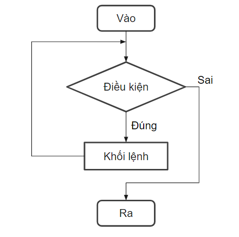
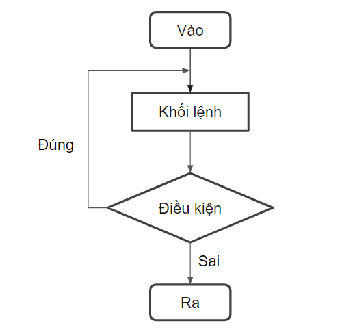

## Vòng lặp while
Cú pháp:  
```java
while(<Điều kiện lặp>){
    <Khối lệnh>;
}
```





Đối với vòng lặp `while`, không có bước khởi tạo biến và tăng/giảm biến. Thay vào đó, bước đầu tiên sẽ là kiểm tra điều kiện lặp, nếu điều kiện đúng, khối lệnh trong vòng lặp mới được thực hiện, và khối lệnh đó sẽ lặp cho đến khi điều kiện sai. Nếu điều kiện sai, khối lệnh sẽ không được thực hiện


Ví dụ: 

```java
int i = 1;
while (i <= 5) {
    System.out.print(i + "\t");
    i++;
}
```

## Vòng lặp do while
Cú pháp:
```java
do {
     <Khối lệnh>;
}while (<Điều kiện>);
```



Với vòng lặp `do-while`, khối lệnh sẽ được thực hiện trước rồi mới tiến hành kiêm tra điều kiện. Do đó nếu điều kiện sai, thì khối lệnh vẫn được thực hiện ít nhất một lần

Ví dụ:
```java
int i = 1;
do{
     System.out.print(i + "\t");
     i++;
}while(i <= 5);
```