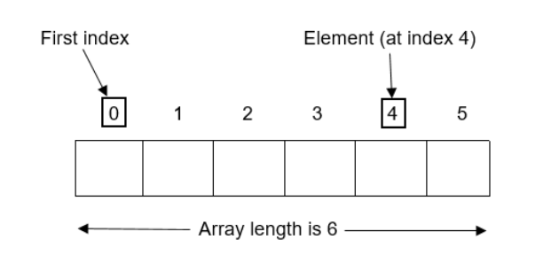

## Mảng là gì?
Mảng là tập hợp các phần tử có cùng tên, cùng kiểu dữ liệu và mỗi phần tử trong mảng được truy xuất thông qua các chỉ số của nó trong mảng  
Mảng trong Java lưu các phần tử theo chỉ số (index), chỉ số của phần tử đầu tiên là 0  

 

## Các kiểu mảng trong Java  
Có hai kiểu mảng trong Java  
- Mảng một chiều
- Mảng đa chiều  

## Mảng một chiều  

Khai báo mảng:  
```java
<Kiểu dữ liệu> <Tên mảng>[];
```

Hoặc
```java
<Kiểu dữ liệu> []<Tên mảng>;
```

Cấp phát bộ nhớ cho mảng:
```java
<Tên mảng> = new <Kiểu dữ liệu>[<Kích thước mảng>];
```

Ví dụ:  
```java
int[] numbers; //Khởi tạo mảng số nguyên numbers
numbers = new int[3]; //Kích thước mảng là 3 (Có thể chứa 3 phần tử)
numbers[0] = 5; //Gán giá trị cho mảng
numbers[1] = 8;
numbers[2] = 2;
```

Hoặc  
```java
String[] names = {"Chris", "Emma", "John", "Robert"};
System.out.println(names[2]); //Lấy ra phần tử ở index 2

System.out.println("Kích thước mảng:" + names.length);
//phương thức length để lấy kích thước mảng
```

**Duyệt mảng**
Bất kỳ vòng lặp đơn giản nào cũng có thể được sử dụng để duyệt mảng. Trong ví dụ dưới đây mình sẽ sử dụng cả vòng lặp `for` và `while` 
- Với vòng lặp `for`:  
```java
for(int i = 0; i < names.length; i++){
    System.out.println(names[i]);
}
```
Trong trình duyệt mảng, sử dụng một biến số nguyên (i) bắt đầu từ 0, do chỉ số của mảng bắt đầu từ 0 và tiến tới độ dài của mảng trừ 1. Ví dụ mảng có 5 phần từ thì sẽ duyệt từ 0 đến 4.

- Với vòng lặp `while`

```java
int i = 0;
while(i < names.length){
    System.out.println(names[i++]);
}
```
Biến i được khai báo bên ngoài vòng lặp.  

Có thể thấy vòng lặp `for` thích hợp hơn vì ta đã biết độ dài của mảng.

