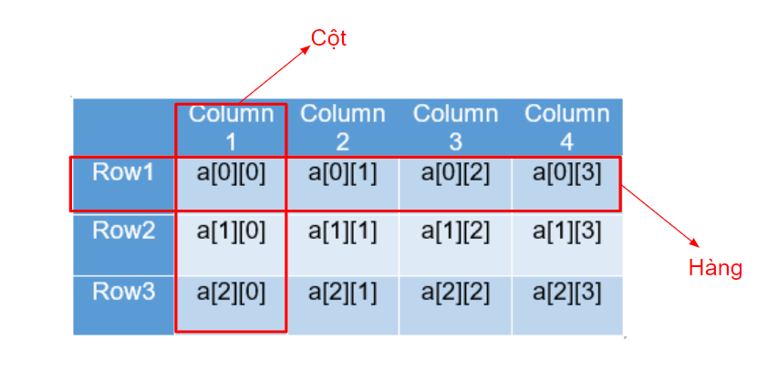

## Mảng đa chiều 
Mảng đa chiều chỉ là tăng số chiều lưu trữ nhiều chiều hơn, hay còn gọi là ma trận. Thông thường ta hay sử dụng mảng hai chiều.  
Đối với mảng hai chiều, dữ liệu được lưu trữ theo hai chiều. Chiều thứ nhất gọi là hàng và chiều thứ hai gọi là cột.

  

Cú pháp khai báo:  
```java
<Kiểu dữ liệu> <Tên mảng>[][];
```
Hoặc
```java
<Kiểu dữ liệu>[][] <Tên mảng>;
```

Cú pháp cấp phát bộ nhớ cho mảng:
```java
<Tên mảng> = new <kiểu dữ liệu>[<Số dòng>][<Số cột>];
```

Ví dụ:
```java
int[][] numbers = new int[2][3];
numbers[0][0] = 7;
numbers[0][1] = 5;
numbers[0][2] = 2;
numbers[1][0] = 4;
numbers[1][1] = 9;
numbers[1][2] = 6;

//Để duyệt mảng đa chiều cần sử dụng 2 vòng lặp, 1 vòng lặp duyệt hàng và một vòng lặp duyệt cột
for(int i = 0; i < numbers.length; i++){
    for(int j = 0; j < numbers[i].length; j++){
        System.out.print(numbers[i][j] + "\t");
    }
    System.out.println();
}
```
