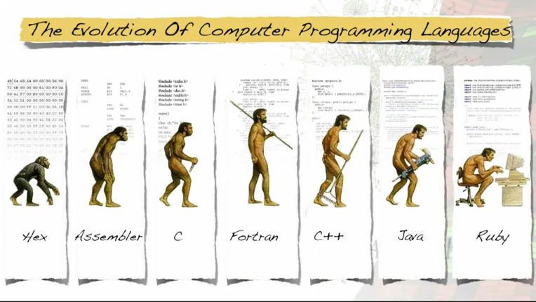

# Lịch sử phát triển  
  

## Những năm 1950 - Lập trình phi cấu trúc

Phát triển phần mềm là một hoạt động khá phức tạp. Việc lập trình chỉ được thực hiện ở một vài nơi trên thế giới. Assembly là một ngôn ngữ phổ biến thời điểm đó, nó sử dụng các thao tác cấp thấp như `add`, `sub`, `goto` và thao tác trực tiếp các địa chỉ bộ nhớ. Việc xây dựng một ứng dụng đơn giản rất chậm và khó. Để tạo một lệnh if đơn giản, cần mất một vào dòng code và đối với một vòng lặp, sẽ mất nhiều hơn một vài dòng,... Sau đó, khả năng nhóm (grouping) và sử dụng lại các đoạn code đã xuất hiện, và kiểu code rất tuyến tính và việc sử dụng lại code chỉ giới hạn trong phạm vi sao chép, dán trong cùng một file hoặc giữa các files  

## Những năm 1960 - Lập trình có cấu trúc  

Lập trình có cấu trúc ra đời, giới thiệu các code blocks, các cấu trúc điều khiển (`if/then/else`, `case`, `for`, `while`, `do`,...) và các quy trình con. Sau đó, người ta có thể tạo ra các code flows thú vị hơn và quan trọng hơn. Đã có thể nhóm các mã lệnh (code instruction) và sử dụng lại chúng mặc dù còn một số hạn chế như quy trình con luôn hoạt động trên cùng các biến toàn cục. Đó là thời điểm những ý tưởng đầu tiên về khả năng tái sử dụng (reusability) được đưa vào thực tế. Algol được sử dụng vào thời điểm này     

## Những năm 1970 -Lập trình thủ tục và lập trình hàm  
**Lập trình thủ tục (procedural programming)** và **lập trình hàm (functional programming)** ra đời vào những năm 1970. Trong thời gian này chúng ta có:

- Procedures: Tập hợp các lệnh không trả về dữ liệu;
- Functions: Tập hợp các lệnh trả về dữ liệu;
- Cấu trúc dữ liệu: Bản ghi, tương tự như một mảng kết hợp;
- Mô-đun: Các code file có thể được nhập (import) vào các code file khác.

Trong những năm 1970 cũng là lúc thuật ngữ “Spaghetti code” được đặt ra, sau lá thư của Edsger W. Dijkstra gửi cho Bộ phận Truyền thông của Hiệp hội Máy tính (CACM) vào năm 1968, với tiêu đề “Đi đến Tuyên bố được coi là Có hại” (Go To Statement Considered Harmful)  

Vào cuối những năm 1970, những ý tưởng đầu tiên về Lập trình sự kiện (Event Oriented Programming) và Trygve Reenskaug viết bài báo của mình về MVC (sử dụng các sự kiện – events).  

Với những cải tiến này, chúng ta có khả năng tái sử dụng (reusability) tốt hơn, vì các chương trình con hay subroutines (hàm và thủ tục) có thể thực hiện cùng một logic với các dữ liệu khác nhau. Chúng ta cũng có thể sử dụng model domain concepts bằng cách nhóm các dữ liệu liên quan thành các cấu trúc dữ liệu phức tạp. Và, cuối cùng, ta đã đưa ra các bước đầu tiên trong việc chia tách và mô-đun hóa, nơi chúng ta có thể tạo code có thể sử dụng lại trong các tập và sự kiện để tách code khách khỏi logic đang được thực thi.  

Có thể kể đến ngôn ngữ như: Pascal, C  

## Những năm 1980 - Lập trình hướng đối tượng  
Lý thuyết và những manh nha về OOP bắt đầu từ những năm 1960, và được thực hiện lần đầu tiên trong những năm 1960 trong ngôn ngữ Simula.  

Tuy nhiên, trong những năm 1980, việc sử dụng mô hình lập trình hiện tại đã trở nên tổng quát: Lập trình hướng đối tượng, với các mức độ hiển thị, phương thức (thông báo), đối tượng, lớp và sau này là các gói. Điều này cũng giống như nói tăng tính đóng gói và mô-đun  

- Visibility levels (Mức độ phạm vi): cho phép bạn điều khiển những gì code có thể truy cập vào một tập dữ liệu cụ thể.
- Classes (lớp): cho phép định nghĩa hay mô hình hóa các domain concepts.  
- Objects (đối tượng): cho phép chúng ta có các instances khác nhau trong cùng domain concepts.
- Packages (gói): cho phép nhóm các lớp lại với nhau để thể hiện một domain hay khái niệm hàm và làm việc cùng nhau trên cùng một ya1c vụ.
- Methods (phương thức): đại diện cho các thủ tục và chức năng, nhưng về mặt khái niệm nên được xem như là các thông báo (hoặc tốt hơn là các lệnh) có thể được cấp cho một loại đối tượng cụ thể.