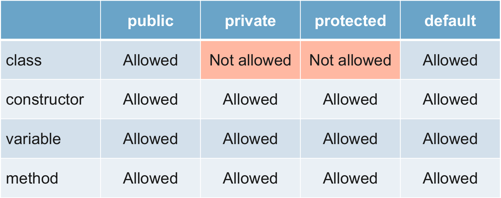
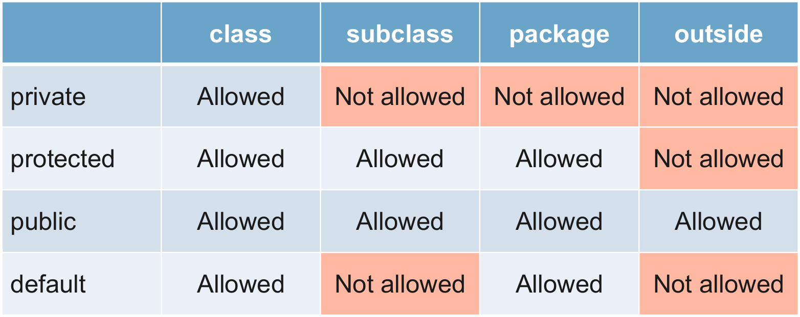

# Phạm vi truy cập  
Phạm vi truy cập (Access modifiers) là xác định độ truy cập phạm vi vào dữ liệu của các thuộc tính, phương thức hoặc class.  
 
# Các loại phạm vi truy cập  
Có 4 loại phạm vi truy cập:  
- `private`
- `default`
- `protected`
- `public`

  

## private  

Private xác định phạm vi truy cập nội bộ một class. Chỉ có thể sử dụng `private` với constructor, biến và phương thức.  

