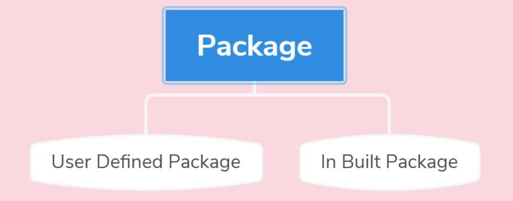
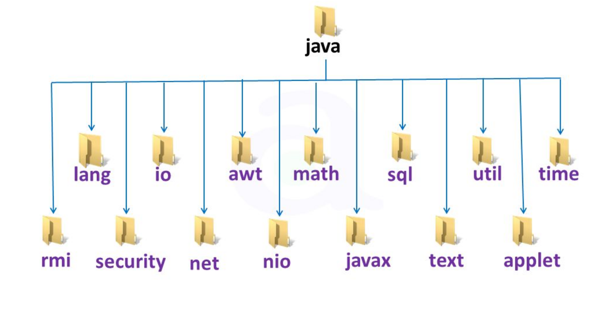
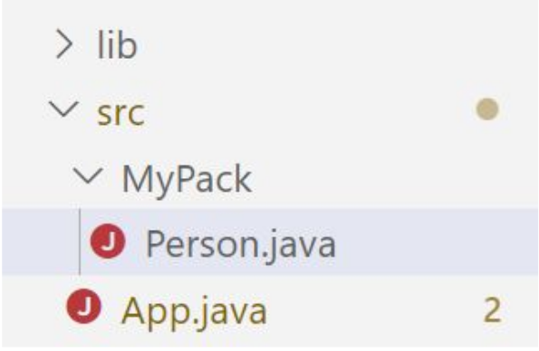

# Package  
Một package trong java được sử dụng để nhóm các lớp liên quan. Ta có thể coi nó như một thư mục.  

Việc sử dụng package nhằm tránh xung đột về tên và code có thể dễ dàng bảo trì hơn  


# Các loại package  
Package được chia thành 2 loại:  

  

## Built - in Package
Java API là một thư viện các lớp được viết sẵn, được sử dụng miễn phí. Thư viện này chứa các thành phần để quản lý đầu vào, cơ sở dữ liệu,...  
Có thể than khảo tại [https://docs.oracle.com/javase/8/docs/api/](https://docs.oracle.com/javase/8/docs/api/)  

Thư viện này được chia thành nhiều package và các lớp. Có nghĩa là ta có thể truy cập một lớp duy nhất hoặc toàn bộ package chứa tất cả các lớp thuộc package đó. Ví dụ:  

```java
import java.util.Scanner; //Truy cập lớp Scanner
import java.util.*; //Truy cập vào package
```



## User - defined Package  
Để tạo package của riêng bạn, bạn cần hiểu rằng Java sử dụng một thư mục hệ thống tệp để lưu trữ chúng. Cũng giống như các thư mục trên máy tính của bạn

  

