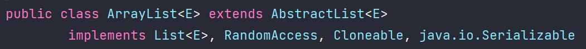

## Lớp ArrayList  
Lớp ArrayList được sử dụng như mảng động để lưu trữ các phần tử.  

Các mảng trong Java có kích thước cố định. Sau khi tạo mảng, ta không thể thay đổi kích thước, dẫn đến việc thêm hoặc bớt phần tử gặp khó khăn  

ArrayList được tạo với một kích cỡ ban đầu. Khi kích cỡ này bị vượt, collection tự động được tăng. Khi các đối tượng bị gỡ bỏ, ArrayList có thể bị giảm kích cỡ.  



## Đặc điểm của ArrayList
Những điểm cần ghi nhớ về lớp ArrayList:

- Có thể chứa các phần tử trùng lặp.
- Duy trì thứ tự của phần tử được thêm vào.
- Không đồng bộ (non-synchronized).
- Cho phép truy cập ngẫu nhiên, tốc độ truy xuất (get) phần tử nhanh vì nó lưu dữ liệu theo chỉ mục.
- Thao tác thêm/ xóa (add/ remove) phần tử chậm vì cần nhiều sự dịch chuyển nếu bất kỳ phần tử nào thêm/ xoá khỏi danh sách.


## Khởi tạo ArrayList trong java
| Constructor | Mô tả |
| --- | --- |
| `ArrayList(int initialCapacity)` | Nó được sử dụng để xây dựng một danh sách mảng mà có dung lượng ban đầu được chỉ định | 
| `ArrayList()` | Nó được sử dụng để khởi tạo một danh sách mảng trống. |
| `ArrayList(Collection<? extends E> c)` | Nó được sử dụng để xây dựng một danh sách mảng được khởi tạo với các phần tử của collection c |  


**Cú pháp khởi tạo ArrayList**
```java
ArrayList<Kiểu dữ liệu> Tên_ArrayList = new ArrayList<>();
```

Ví dụ:  
```java
ArrayList<Integer> numbers = new ArrayList<>();

ArrayList<String> names = new ArrayList<>();
```  

## Các phương thức của lớp ArrayList  
| Phương thức | Mô tả |
| --- | --- |
| `boolean add(Object o)` | Thêm phần tử được chỉ định vào cuối một danh sách | 
| `void add(int index, Object element)` | Chèn một phần tử được chỉ định tại vị trí (index) được chỉ định vào danh sách |
| `boolean addAll(Collection c)` | Thêm tất cả các phần tử trong collection được chỉ định vào cuối của danh sách gọi phương thức, theo thứ tự chúng được trả về bởi bộ lặp iterator |
| `boolean addAll(int index, Collection c)` | Thêm tất cả các phần tử trong collection được chỉ định vào danh sách gọi phương thức, bắt đầu từ vị trí đã chỉ định |
| `Object get(int index)` | Trả về phần tử tại index chỉ định |  
| `int indexOf(Object o)` | Lấy vị trí (index) trong danh sách với sự xuất hiện đầu tiên của phần tử được chỉ định, hoặc -1 nếu danh sách không chứa phần tử này | 
| `int lastIndexOf(Object o)` | Lấy vị trí (index) trong danh sách với sự xuất hiện cuối cùng của phần tử được chỉ định, hoặc -1 nếu danh sách không chứa phần tử này | 
| `Object remove(int index)` | Gỡ bỏ phần tử tại index đã cho | 
| `void retainAll(Collection c)` | Chỉ giữ lại các phần tử trong tập hợp này được chứa trong tập hợp đã chỉ định (những phần tử thuộc collection c) | 
| `void removeAll(Collection c)` | Loại bỏ tất cả các phần tử của bộ sưu tập này cũng có trong bộ sưu tập được chỉ định (những phần tử thuộc collection c) | 
| `Object set(int index, Object element)` | Thay thế phần tử tại vị trí đã cho trong list này với phần tử đã xác định | 
| `Object[] toArray(Object[] a)` |  toArray(Object[] a)	Chuyển một danh sách sang mảng và trả về một mảng chứa tất cả các phần tử trong danh sách này theo đúng thứ tự. |  
| `Object clone()` | Tạo một bản sao của ArrayList | 
| `void clear()` | Xóa tất cả các phần tử từ danh sách | 
| `void trimToSize()` | Cắt dung lượng của thể hiện ArrayList này là kích thước danh sách hiện tại |