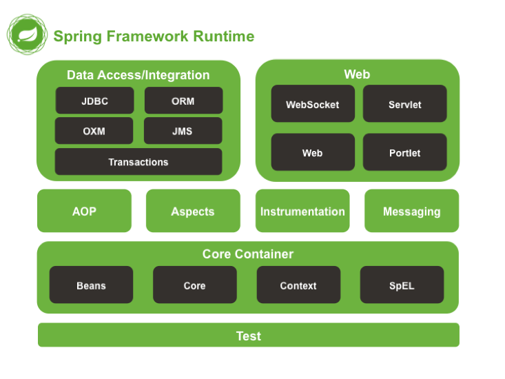
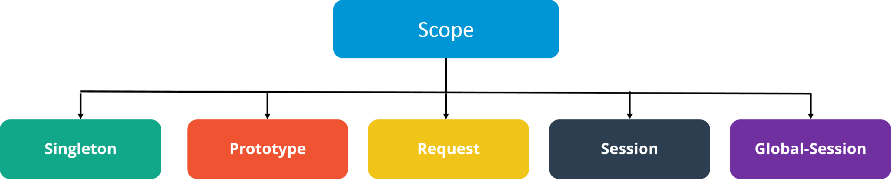
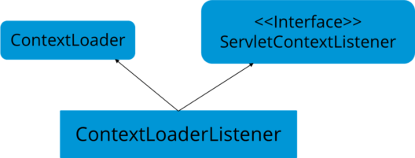

Spring được coi là khung framework phổ biến nhất được sử dụng bởi các nhà phát triển Java, ít nhất là khi nói đến việc xây dựng ứng dụng. Đây là lý do tại sao không có gì ngạc nhiên khi ngày càng nhiều nhà tuyển dụng tìm kiếm các nhà phát triển và lập trình viên Java có thể thành thạo cả Java và Spring. Nếu bạn đang nhắm đến một công việc của một nhà phát triển với một vài (hoặc rất nhiều!) chuyên môn về Java Spring thì có lẽ sẽ là một ý tưởng tốt để xem xét những gì nên có từ cuộc phỏng vấn xin việc.  

 

  

## 1. Spring là gì?
Theo wikipedia, Spring framework là một framework ứng dụng và bộ chứa đảo ngược điều khiển cho nền tảng cho nền tảng Java. Chức năng chính của framework này có thể áp dụng cho bất kỳ ứng dụng Java nào. Tuy nhiên, bản mở rộng danh cho việc xây dựng ứng dụng trên nền web cũng được phát triển trên nền tảng Java EE.  
Spring cơ bản là một khung tích hợp, nhẹ, có thể đuọc sử dụng để phát triển các ứng dụng doanh nghiệp trong Java

## 2. Các modules của Spring Framework
Một số modules Spring Framework quan trọng:  
- Spring Context: Dành cho dependency injection
- Spring AOP: Dành cho lập trình hướng khía cạnh
- Spring DAO: Cho các hoạt động cơ sở dữ liệu sử dụng DAO
- Spring JDBC: Dành cho JDBC và hỗ trợ DataSource
- Spring ORM: Dành cho các công cụ ORM ví dụ như Hibernate
- Spring Web Module: Để tạo web applications
- Spring MVC: Triển khai mô hình Model-View-Controller để tạo web applications, web service,...

## 3. Danh sách các annotation quan trọng trong Spring  
Một số annotaion quan trọng có thể kể đến như:  
- `@Required`
- `@Autowired`
- `@Qualifier`
- `@Resource`
- `@PostConstruct`
- `@PreDestroy`  

## 4. Bean trong Spring là gì? Liệt kê các Scopes của Spring Bean
Bean là ứng dụng tạo thành xương sống của ứng dụng Spring. Chúng được quản lý bởi Spring IoC container. Nói cách khác, bean là một đối tượng được khởi tạo, lắp ráp và quản lý bởi một vùng chứa Spring IoC  
Có 5 loại Scopes trong Spring bean:

  
- Singleton: Chỉ một instance của bean sẽ được tạo cho mỗi vùng chứa. Đây là scope mặc định cho Spring bean. Trong khi sử dụng scope này, hãy đảm bảo rằng spring bean không có các phiên bản được chia sẻ, nếu không nó có thể dẫn đến vấn đề không nhất quán dữ liệu vì nó không phải thread-safe  
- Prototype: Một instance mới được tạo mỗi khi bean được yêu cầu
- Request: Tương tự prototype scope. Tuy nhiên, nó được sử dugnj cho các ứng dụng web. Một instance mới của bean sẽ được tạo cho mỗi yêu cầu HTTP
- Session: Một bean mới sẽ được tạo cho mỗi phiên HTTP bởi vùng chứa
- Global-session: Được sử dụng để tạo các global session bean cho các ứng dụng Portlet

## 5. Vai trò của DispatcherServlet và ContextLoaderListener
**DispatcherServlet** về cơ bản là bộ điều khiển phía trước trong ứng dụng Spring MVC vì nó tải tệp cấu hình spring bean và khởi tạo tất cả các bean đã đực cấu hình. Nếu annotations được bật, nó cũng quét các package để định cấu hình bất kỳ bean nào đã được chú thích bằng annotaion `@Component`, `@Controller`, `@Repository` hoặc `@Service`  

  

**ContextLoaderListener** là trình lắng nghe để khởi động và tắt WebAppicationContext trong Spring. Một số chức năng quan trọng của nó bao gồm gắn vòng đời của Application Context với vòng đời của ServletContext và tự động tạo ApplicationContext 

  

## 6. Sự khác biệt giữa constructor injection và setter injection

| Constructor injection | Setter injection |
| --- | --- |
| Không Partial Injection | Partial Injection |
| Không ghi đè setter | Ghi đè constructor nếu nó được xác định | 
| Tạo một instance mới nếu có bất kỳ sửa đổi nào sảy ra | Không tạo instance mới nếu thay đổi giá trị của thuộc tính |
| Sử dụng tốt nhất khi có nhiều thuộc tính | Sử dụng tốt hơn khi có ít thuộc tính |  

## 7. Autowiring trong Spring là gì?  
Autowiring cho phép lập trình viên tự động đưa bean vào. Chúng ta không cần viết injection logic.   

Một số modes autowiring:  

| Mode | Mô tả |
| --- | --- |
| no | đây là chế độ mặc định, có nghĩa là autowiring không được kích hoạt |  
| byName | Tự động liên kết một thuộc tính đến một thành phần có tên trùng với tên của thuộc tính đó |  
| byType | Tự động liên kết một thuộc tính đến một thành phần có kiểu khớp với kiểu của thuộc tính đó | 
| constructor | Tự động liên kết một thuộc tính đến một thành phần có kiểu khớp với kiểu của tham số trong constructor |  

## 8. Xử lý ngoại lệ trong Spring MVC Framework
Spring MVC Framework cung cấp các cách sau để giúp xử lý ngoại lệ:  
**Controller based**  
Chúng ta có thể định nghĩa các phương thức xử lý ngoại lệ trong các lớp điều khiển. Tất cả những gì cần là chú thích các phương thức này bằng annotation `@ExceptionHandler`  

**Global Exception Handler**  
Xử lý ngoại lệ là một mối quan tâm xuyên suốt và Spring cung cấp annotation `@ControllerAdvice` mà chúng ta có thể sử dụng với bất kỳ lớp nào để xác định trình xử lý ngoại lệ toàn cục của chúng ta  

**HandlerExceptionResolver implementation**  
Đối với các trường hợp ngoại lệ chung, hầu hết thời gian chúng ta phân phát các trang tĩnh. Spring Framework cung cấp inteface `HandlerExceptionResolver` mà chúng ta có thể triển khai để tạo trình xử lý ngoại lệ chung. 

## 9. Một số annotation quan trọng trong Spring  
- `@Controller`: Sử dụng cho class controller trong dự án Spring MVC
- `@RequestMapping`: Sử dụng để cấu hình URI mapping trong các phương thức xử lý controller. Đây là annotation rất quan trọng.  
- `@ResponseBody`: Gửi đối tuognjw dưới dạng response, thường là để gửi dữ liệu XML hoặc JSON dưới dạng response
- `@PathVariable`: để ánh xạ các giá trị dynamic từ URI tới các đối số của phương thức trình xử lý
- `@Autowired`: Cho cacsphuj thuộc autowiring trong spring bean
- `@Qualifier`: với annotation @Autowired để tránh nhầm lẫn khi có nhiều instance của bean
- `@Service`: Sử dụng cho class service
- `@Scope`: để định hình phạm vi của Spring bean
- `@Configuration`, `@ComponentScan` và `@Bean`: Cho các cấu hình dựa trên java  

## 10. Làm thế nào để tích hợp Spring và Framework?  
Chúng ta có thể sử dụng Spring ORM để tích hợp Spring và Hibernate framework nếu đang sử dụng Hibernate 3+ trong đó SessionFactory cung cấp phiên hiện tại, khi đó bạn nên tránh sử dụng các lớp HibernateTemplate hoặc HibernateDaoSupport và tốt hơn là sử dụng DAO pattern với dependency injection để tích hợp  
Ngoài ra, Spring ORM cung cấp hỗ trợ sử dụng trình quản lý Spring declarative transaction  

## 11. Tên các loại transaction management mà Spring hỗ trợ
Có 2 loại transacion management mà Spring hỗ trợ:  
- Programmatic transaction management
- Declarative transaction management