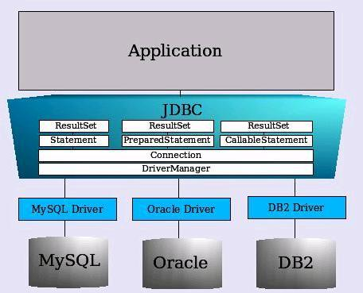
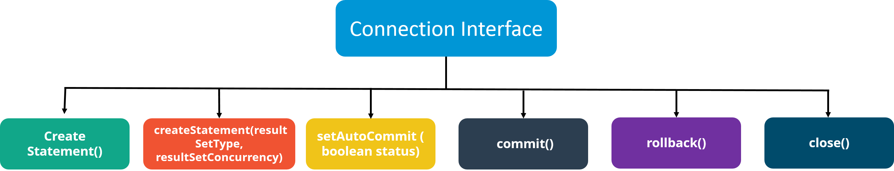

Hiện nay hầu hết các ứng dụng Java hay các framework của nó đều dần chuyển sang các ORM(Object Relational Mapping) để làm việc với database, có thể kể đến là hibernate được sử dụng rộng rãi. Thế nên mọi người có xu hướng dần quên đi JDBC, thế nhưng các bạn có biết rằng bên dưới hibernate đang sử dụng JDBC để để kết nối đến database và thực thi các lệnh SQL được nó tạo ra.

  

Trong phần này chúng ta sẽ cùng điểm qua một sô câu hỏi phỏng vấn phần JDBC nhé

Nếu các bạn chưa xem các phần trước, tham khao tại đây:  
[100+ Câu hỏi phỏng vấn Java (Phần 1) - Basic Java](https://techmaster.vn/posts/36851/100-cau-hoi-phong-van-java-phan-1-basic-java)  
[100+ Câu hỏi phỏng vấn Java (Phần 2) - OOP](https://techmaster.vn/posts/36860/100-cau-hoi-phong-van-java-phan-2-oop)

 

## 1, JDBC Driver là gì?

JDBC driver là một thành phần phần mề, cho phép ứng dụng Java tương tác với database. Một trong những nhiệm vụ của JDBC driver là chuyển đổi kiểu dữ liệu của Java thành kiểu dữ liệu của JDBC tương ứng trước khi gửi giá trị dữ liệu tới database.  
Có 4 loại JDBC driver:  

- JDBC-ODBC bridge driver  
- Native-API driver  
- Network Protocol driver  
- Thin driver  
 

## 2, Các bước để kết nối tới database trong Java
- Load driver
- Tạo kết nối  
- Tạo câu lệnh truy vấn SQL  
- Thực thi câu lệnh truy vấn SQL
- Đóng kết nối  
 

## 3, Các thành phần của JDBC API gồm:  
Package java.sql chứa các interface và class cho JDBC API  

- Interface:  
    - Conection
    - Statement  
    - PreparedStatement
    - ResultSet 
    - ResultSetMetadata  
    - DatabaseSetMetadata
    - CallableStatement  
- Class:
    - DriverManger
    - Blob
    - Clob
    - Types
    - SQLException  
 

## 4, Vai trò của class DriverManager   
Class DriverManager hoạt động như một giao diện giữa người dùng và driver. Nó theo dõi các driver có sẵn và xử lý việc thiết lập kết nối giữa database và driver thích hợp. Class DriverManager duy trì một danh sách các lớp Driver mà đã được đăng ký bởi chính chúng bằng cách gọi phương thức DriverManage.registerDriver().  
 

## 5, Interface Connection là gì?
Một Connection trong Java là phiên làm việc giữa ứng dụng java và database. Đối tượng được sử dụng để tạo Statement, PreparedStatement và DatabaseMetaData. Interface Connection cung cấp các phương thức commit(), rollback()  

Các phương thức của interface Connection gồm:  

  
 

## 6, Interface ResultSet được sử dụng để làm gì?  

Có thể nói rằng ResultSet là một bảng dữ liệu mà biểu diễn tập kết quả từ cơ sở dữ liệu mà được trả về bởi các lệnh SQL. Một đối tượng ResultSet duy trì một con trỏ trỏ tới hàng dữ liệu hiện tại của nó. Ban đầu, con trỏ được đặt trước hàng đầu tiên. Theo mặc định, đối tượng ResultSet chỉ có thể được di chuyển thuận về trước và nó là không thể cập nhật.

 

## 7, Interface ResultSetMataData được sử dụng để làm gì?  

Nếu bạn muốn lấy thông tin như tổng số cột, tên cột, kiểu của cột, … trong một bảng, thì bạn nên sử dụng ResultSetMetaData Interface bởi vì nó cung cấp các phương thức để lấy metadata từ đối tượng ResultSet.

 

## 8, Interface DatabaseMetaData được sử dụng để?

Nếu bạn muốn có thông tin toàn diện về cơ sở dữ liệu, bạn sử dụng các phương thức của DatabaseMetaData Interface. Các thông tin này bao gồm tên của Database product, phiên bản Database product, tên của driver, tổng số bảng, tổng số view, …

 

## 9, Batch processing trong JDBC là gì?  
Batch processing trong JDBC là nhóm các lệnh có liên quan trong một batch và đệ trình chúng. Trong đó, các thao tác lệnh của chương trình được thực thi liên tiếp nhau mà không cần sự can thiệp của người dùng  

 

## 10, Sự khác biệt giữa excute, excuteQuery và excuteUpdate  

Câu lệnh `excute(String query)` được dử dụng để thực thi bất kỳ truy vấn SQL nào và nó trả về `true` nếu kết quả là ResultSet (Khi sử dụng lệnh `Select`), trả về `false` nếu không có đối tượng ResultSet (Khi sử dụng lệnh `Insert` hoặc `Update`). Chúng ta có thể sử dụng phương thức `getResultSet()` để lấy ResultSet và phương thức `getUpdateCount()` để truy xuất số lượng cập nhật  

Câu lệnh `excuteQuery(String query)` được sử dụng để thực hiện các truy vấn `Select` và trả về ResultSet. Result set không bao giờ trả về null ngay cả khi không có bản ghi nào phù hợp với truy vấn. Khi thực hiện truy vấn `Select`, chúng ta nên sử dụng phương thức `excuteQuery(String query)` để nếu ai đó cố gắng thực hiện lệnh `insert` hoặc `update` thì sẽ ném ra ngoại lệ SQLException với message *"Không thể sử dụng phương thức executeQuery để cập nhật"*  

Câu lệnh `excureUpdate(String query)` được sử dụng khi muốn thực hiện `insert`, `update` hoặc `delete` hoặc câu lệnh DDL không trả về kết quả nào. Đâu ra là int và giống với số hàng cho các câu lệnh DML. Đối với các câu lệnh DDL, đầu ra là 0  

Bạn chỉ nên sử dụng phương thức `execute()` khi bạn không chắc chắn về kiểu câu lệnh, còn lại hãy sử dụng phương thức `executeQuery()` hoặc `executeUpdate()`.

 

## 11, JDBC statements là gì?  
Các câu lệnh JDBC về cơ bản là các câu lệnh được sử dụng để gửi các lệnh SQL đến database và lấy lại dữ liệu từ database. Các phương thức khác nhau như `execute()`, `executeUpdate()`, `executeQuery()`, v.v. được cung cấp bởi JDBC để tương tác với database  
JDBC hỗ trợ 3 loại câu lệnh:  
- Statement: Được sử dụng cho mục đích truy cập database và thực hiện truy vấn static SQL trong thời gian chạy
- PreparesStatement: Sử dụng để cung cấp tham số đầu vào cho truy vấn trong quá trình thực thi
- CallableStatement: Sử dụng để truy cập các thủ tục được lưu trữ trong database giúp chấp nhận các runtime parameter
