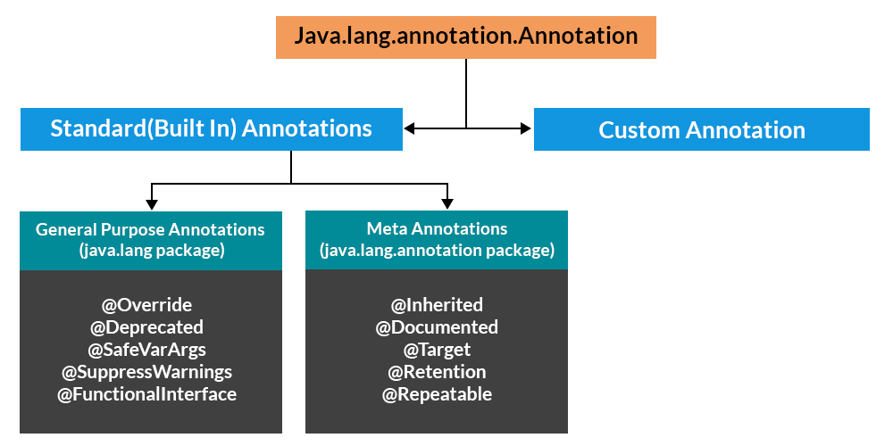
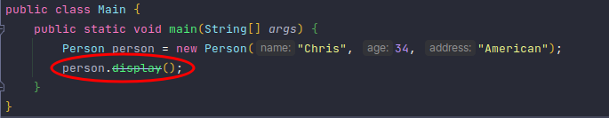
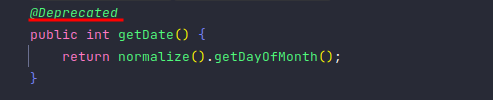
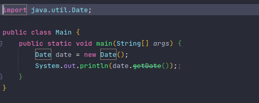
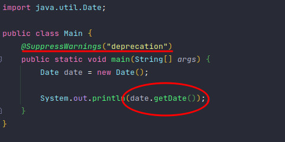
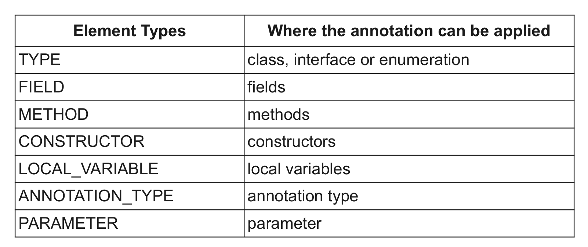

Khi lập trình Java, chắc chắn các bạn sẽ luôn thấy các từ khóa được đi kèm với **@**, ví dụ như `@Override`, `@Deprecated`,... Nó là gì? có gây ảnh hưởng đến chương trình? bỏ đi có sao không?   
Trong bài viết này, chúng ta sẽ cùng tìm hiểu về annotaion, mục đích sử dụng, những annotation được định nghiawx sãn và các để tạo ra một annotation.   

## Annotation là gì?
Annotation trong Java là một thẻ đại diện cho metadata, nó thường đi kèm với lớp, interface, phương thức hoặc các trường để chỉ ra một số thông tin bổ sung có thể được sử dụng bởi trình biên dịch Java và JVM.  
Annotation sử dụng để cung cấp thông tin bổ sung, do đó nó là một tùy chọn thay thế cho XML và marker interface.  
Đối với bạn nào chưa biết marker interface là gì thì marker interface hay còn được gọi là Tagging interface là một interface không có bất kỳ phương thức và thuộc tính nào bên trong nó. Nó cung cấp thông tin runtime type về object, vì vậy compiler và JVM có thêm thông tin về đối tượng để thực hiện một số hoạt động hữu ích.  
Một số marker có thể kể đến như `Serializable`, `Cloneable`, `EventListener`, `RandomAccess`,...  

**Đặc điểm của annotation:**  
- Annotation được bắt đầu với **@**
- Annotation không làm thay đổi hoạt động của một chương trình đã compile  
- Annotation giúp liên kết thông tin với các phần tử của chương trình (biến instance, constructor, method và class)  
- Annotation không phải là chú thích tuần túy vì chúng có thể thay đổi cách trình biên dịch xử lý chương trình  

**Annotation được sử dụng cho mục đích:**  
- Chỉ dẫn cho trình biên dịch  
- Chỉ dẫn trong thời điểm biên dịch  
- Chỉ dẫn trong thời gian chạy

<br>


## Các loại annotation  

Có 5 loại annotation trong java:  
### 1. Marker Annotation  
Nhằm mục đích để đánh dấu một khai báo. Các chú thích đánh dấu không chứa bất kỳ thành viên nào và không chứa bất kỳ dữ liệu nào. Có thể kể đến `@override`  

Ví dụ:  
```java
@TestAnnotation()
```

### 2. Single value Annotation  
Annotaion này chỉ chứa một thành viên và cho phép dạng viết tắt xác định giá trị thành viên. Khi chúng ta áp dụng chú thích này, chúng ta chỉ cần chỉ định giá trị cho thành viên mà không cần chỉ định tên thành viên. Tuy nhiên để sử dụng cách viết tắt này phải có một giá trị cho tên của thành viên  

Ví dụ:  
```java
@TestAnnotation(“testing”);
```

### 3. Full Annotation
Các annotation này bao gồm nhiều thành viên dữ liệu, tên, giá trị, pair  

Ví dụ: 
```java
@TestAnnotation(author = "Eri", version = "1.0")
```

### 4. Type Annotation 

Nhũng annotation này được sử dụng cho bất kỳ nơi nào sử dụng type. Ví dụ, chúng ta có thể chú thích kiểu trả về của một phương thức. Chúng được khai báo với annotation `@Target`  

Ví dụ:  
```java
@Target(ElementType.FIELD)
```

### 5. Repeating Annotation
Repeating Annotation trong Java là chú thích được áp dụng nhiều lần cho một mục. Các repeating annotation phải được chú thích bằng annotation `@Repeatable`, có trong gói `java.lang.annotation`. Giá trị của annotation này chỉ định loại vùng chứa cho repeating annotation. Do đó, để tạo một repeating annotation, chúng ta cần tạo annotation vùng chứa sau đó chỉ định loại annotation làm đối số cho annotation `@Repeatable`   

Ví dụ: 
```java
@Repeatable(MyRepeatedAnnos.class)
```

<br>



<br>

Giờ hãy cùng tìm hiểu chi tiết các Annotation có sẵn
## Built-in Java Annotation
### @Deprecated  

`@Deprecated` là một marker annotation, nó chỉ ra rằng một class hoặc method đã bị lỗi thời và không nên sử dụng nữa.  
Bạn có thể tìm thấy nó trong một số class và phương thức có sẵn trong Java ví dụ như trong class `Date` nằm trong package `java.util`, có thể tìm thấy một số constructor, method bị đánh dấu `@Deprecated`   

Xem ví dụ dưới đây:  
```java
public class Person {
    private String name;
    private int age;
    private String address;

    public Person(String name, int age, String address) {
        this.name = name;
        this.age = age;
        this.address = address;
    }

    @Deprecated
    public void display(){
        System.out.printf("Tôi tên là %s, năm nay tôi %d tuổi, tôi đến từ %s", name, age, address);
    }
}
```



Do bị đánh dấu `@Predecated` nên khi method `display()` được gọi sẽ hiện ra cảnh báo.  

### @Override
Annotation `@Override` là một marker annotation, nó được sử dụng cho các phương thức ghi đè của phương thức trong class cha. Nếu phương thức này không hợp lệ với một phương thức trong class cha, trình biên dịch sẽ báo lỗi.    
Hãy cùng xem ví dụ dưới đây  
```java
public class Person {
    private String name;
    private int age;
    private String address;

    public Person(String name, int age, String address) {
        this.name = name;
        this.age = age;
        this.address = address;
    }

    public void display(){
        System.out.printf("Tôi tên là %s, năm nay tôi %d tuổi, tôi đến từ %s", name, age, address);
    }
}
```
```java
public class Student extends Person{
    private String school;

    public Student(String name, int age, String address, String school) {
        super(name, age, address);
        this.school = school;
    }

    @Override
    public void display() {
        super.display();
        System.out.printf(". Tôi đang học tại %s", school);
    }
}
```
```java
public class Main {
    public static void main(String[] args) {
        Person person = new Student("Chris", 34, "American", "Techmaster");
        person.display();
    }
}
```

Kết quả trả về:
```
Tôi tên là Chris, năm nay tôi 34 tuổi, tôi đến từ American. Tôi đang học tại Techmaster
```
Trong ví dụ trên mình có class `Student` kế thừa `Person` và override phương thức `display()`. Lúc này xuất hiện annotation `@Override` trên phương thức `display()` tại lớp con.  
Annotation này không bắt buộc phải ghi chú trên phương thức `display()`, tuy nhiên, khi thực hiện ghi đè phương thức ta nên sử dụng annotation này để đánh dấu phương thức. Việc này giúp code dễ đọc và dễ bảo trì.  
Hãy thử đổi tên phương thức của lớp cha và xem kết quả nhé.    

### @SuppressWarnings
Annotation này được sử dụng để hướng dẫn trình biên dịch bỏ qua những cảnh báo cụ thể  
Java chia cảnh bảo ra thành 2 dạng: *deprecated* và *unchecked*  
Cùng xem ví dụ dưới đây:  




Phương thức `getDate()` của class `Date` đang bị chú thích `@Deprecated`, nên khi mình gọi tới phương thức này trong `main()`, xuất hiện cảnh báo.  
Giờ mình sẽ áp dụng annotation `@SuppressWarnings`    


Có thể thấy các cảnh báo đã bị loại bỏ khi mình sử dụng annotation `@SuppressWarnings`  

Tuy nhiên bạn sẽ thấy có các tham số được truyền vào bên trong annotation. Các tham số này có ý nghĩa:  
- `deprecation` để thông báo trình biên dịch không cảnh báo việc sử dụng phương thức có sử dụng `@Deprecation`.
- `unchecked` để thông báo trình biên dịch không cảnh báo việc sử một ép kiểu không an toàn.
- `rawtypes` để thông báo trình biên dịch không cảnh báo việc khai báo kiểu dữ liệu không tường minh.  

### @Documented
Annotation này chỉ ra rằng annotation mới nên được bao gồm trong tài liệu Java được tạo ra bởi các công cụ tạo tài liệu Java

### @Target
Sử dụng để chú thích cho annotation khác và annotation đó sẽ được sử dụng trong phạm vi nào  



### @Retention  
Annotation `@Retention` dùng để chú thích mức độ tồn tại của một annotation nào đó.  
Có 3 mức nhận thức tồn tại được chú thích:  
- RetentionPolicy.SOURCE: Tồn tại trên code nguồn, và không được bộ dịch (compiler) nhận ra.  
- RetentionPolicy.CLASS: Mức tồn tại được bộ dịch nhận ra, nhưng không được nhận biết bởi máy ảo tại thời điểm chạy (Runtime)
- RetentionPolicy.RUNTIME: Mức tồn tại lớn nhất, được bộ dịch (compiler) nhận biết, và máy ảo thời điểm chạy cũng nhận ra sự tồn tại của nó.

### @Inherited
Annotation chỉ ra rằng loại chú thích có thể được kế thừa từ lớp cha (mặc định là false). Khi người dùng truy vấn kiểu annotation của lớp con và lớp con không có annotation cho kiểu này thì lớp cha của lớp được truy vấn cho loại chú thích sẽ được gọi. Annotation này chỉ áp dụng cho các khai báo lớp.


## Custom annotation
Mình sẽ tạo 3 custom annotation với mục tiêu tuần tự hóa một đối tượng thành một chuỗi JSON

### 1. Sử dụng cho phạm vi Class
```java
@Retention(RetentionPolicy.RUNTIME)
@Target(ElementType.TYPE)  //Sử dụng cho phạm vi Class
public @interface MyAnnotationClass {
}
```

### 2. Sử dụng cho phạm vi method
Để tuần tự hóa một đối tượng thành một chuỗi JSON, cần phải thực thi một số phương thcuws để khởi tạo một đối tượng. Do đó, mình sẽ tạo annotation để đánh dấu phương thức này. 
```java
@Retention(RetentionPolicy.RUNTIME)
@Target(ElementType.METHOD)  //Sử dụng cho phạm vi method
public @interface MyAnnotationMethod {
}
```

### 3. Sử dụng cho phạm vi field
Annotation này để đánh dấu các trường sẽ đưa vào JSON đã tạo
```java
@Retention(RetentionPolicy.RUNTIME)
@Target(ElementType.FIELD) //Sử dụng cho phạm vi các trường
public @interface MyAnnotationField {
    public String key() default "";
}
```

### Sử dụng các annotation vừa tạo
```java
public class User {
    @DBField(name = "id", isPrimaryKey = true, type = Long.class)
    private long id;

    @DBField(name = "name", type = String.class)
    private String name;

    @DBField(name = "email", type = String.class)
    private String email;

    @DBField(name = "created", type = LocalDate.class)
    private LocalDate created;

    public User(long id, String name, String email, LocalDate created) {
        this.id = id;
        this.name = name;
        this.email = email;
        this.created = created;
    }

    public long getId() {
        return id;
    }

    public void setId(long id) {
        this.id = id;
    }

    public String getName() {
        return name;
    }

    public void setName(String name) {
        this.name = name;
    }

    public String getEmail() {
        return email;
    }

    public void setEmail(String email) {
        this.email = email;
    }

    public LocalDate getCreated() {
        return created;
    }

    public void setCreated(LocalDate created) {
        this.created = created;
    }
}
```
```java
public class Main {
    public static void main(String[] args) throws IllegalAccessException {
        User user = new User(1, "John", "john@gmail.com", LocalDate.now());

        for(Field field : user.getClass().getDeclaredFields()){
            DBField dbField = field.getAnnotation(DBField.class);
            System.out.println("field name: " + dbField.name());

            field.setAccessible(true);
            Object value = field.get(user);
            System.out.println("field value: " + value);

            System.out.println("field type: " + dbField.type());
            System.out.println("is primary: " + dbField.isPrimaryKey());
            System.out.println();
        }
    }
}
```

Kết quả trả về:  
```
field name: id
field value: 1
field type: class java.lang.Long
is primary: true

field name: name
field value: John
field type: class java.lang.String
is primary: false

field name: email
field value: john@gmail.com
field type: class java.lang.String
is primary: false

field name: created
field value: 2021-12-14
field type: class java.time.LocalDate
is primary: false
```
