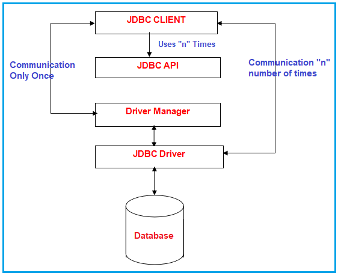
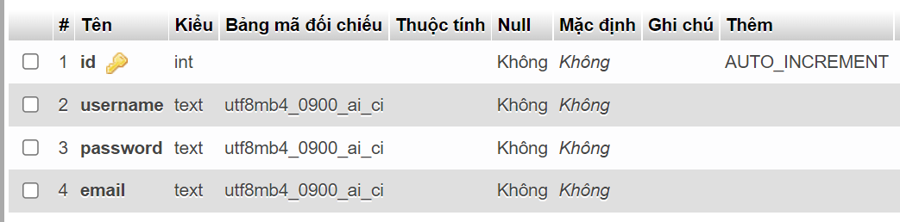
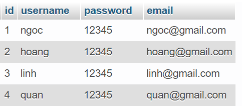
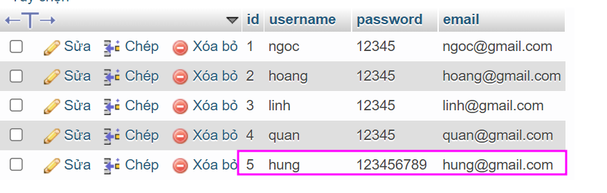
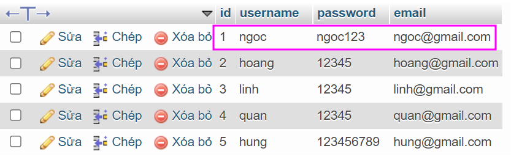
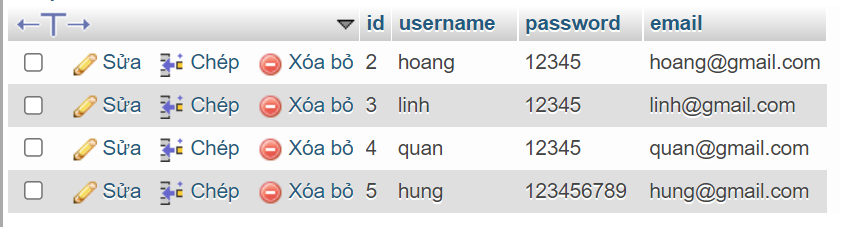

Hiện nay hầu hết các ứng dụng Java hay các framework của nó đều dần chuyển sang các ORM(Object Relational Mapping) để làm việc với database, có thể kể đến là hibernate được sử dụng rộng rãi. Thế nên mọi người có xu hướng dần quên đi JDBC, thế nhưng các bạn có biết rằng bên dưới hibernate đang sử dụng JDBC để để kết nối đến database và thực thi các lệnh SQL được nó tạo ra.  
Trong loạt bài viết này, chúng ta sẽ cùng tìm hiểu về JDBC và cách sử dụng chúng.  

<br>


## JDBC là gì?
JDBC - Java Database Conectivity, là một API chuẩn để kết nối giữa ngôn ngữ lập trình Java và các database. Nó là một phần của JavaSE (Java Standard Edition). API JDBC sử dụng JDBC drivers để kết nối với cơ sở dữ liệu.  
 


## Kiến trúc JDBC



- JDBC API: Cho phép chương trình Java thực thi các câu lệnh SQL và truy xuất kết quả. Một số lớp và interface quan trọng được định nghĩa trong JDBC API như sau:
- DriverManager: Đóng vai trò quan trọng trong kiến trúc JDBC. Nó sử dụng một số quy trình điều khiển dành riêng cho cơ sở dữ liệu để kết nối hiệu quả các ứng dụng doanh nghiệp với database  
- JDBC Driver: Để giao tiếp với nguồn dữ liệu thông qua JDBC, bạn cần JDBC Driver để giao tiếp với nguồn dữ liệu tương ứng. Có 4 loại JDBC drivers:  
    - JDBC - ODBC Bridge Driver
    - Native Drive  
    - Network Protocol Driver
    - Thin driver  

## Các thành phần chính trong JDBC
- DriverManager: Là một class dùng để quản lý danh sách các Driver  
- Driver: Là một interface, chịu trách nhiệm xử lý các hoạt động giao tiếp giữa ứng dụng và database  
- Connection: Là một interface, cung cấp các phương thức cho việc thao tác với database  
- Statement: Là một interface, để thực thi các câu lệnh SQL xuống database  
- ResultSet: Là một bảng dữ liệu mà biểu diễn tập kết quả từ cơ sở dữ liệu trả về bởi các lệnh SQL
- SQLException: Xử lý ngoại lệ xảy ra trong database

## Các bước kết nối database với Java
- Load driver
- Tạo kết nối (Create Connection)
- Tạo câu lệnh truy vấn SQL (Statement)  
- Thực thi câu lệnh truy vấn SQL (Excute query)  
- Đóng kết nối (Close Connection)  


## Tạo project ví dụ JDBC
### Chuẩn bị database  
Trong ví dụ này mình sẽ sử dụng MySQL. Mình có một bảng `users` với cấu trúc sau: 

    

Thêm một số dữ liệu vào bảng users  

  

### Cài đặt thư viện  

Ở đây mình sẽ sử dụng Maven để quản lý chương trình Java  
Add 2 `dependency` vào file pom.xml

```java
<!-- https://mvnrepository.com/artifact/com.oracle.database.jdbc/ojdbc10 -->
<dependency>
    <groupId>com.oracle.database.jdbc</groupId>
    <artifactId>ojdbc10</artifactId>
    <version>19.13.0.0.1</version>
</dependency>

<!-- https://mvnrepository.com/artifact/mysql/mysql-connector-java -->
<dependency>
    <groupId>mysql</groupId>
    <artifactId>mysql-connector-java</artifactId>
    <version>8.0.28</version>
</dependency>
```  

Nếu bạn sử dụng database khác thay vì MySQL thì hãy sử dụng các `dependency` khác  

### Tạo kết nối tới database  
Để có thể kết nối tới database chúng ta cần chuẩn bị các thông tin như: hostname, username, password, database  

```java
public class ConnectJDBC {
    private String hostName = "localhost:8082";
    private String dbName = "my_database";
    private String username = "root";
    private String password = "123";

    private String connectionURL = "jdbc:mysql://"+hostName+"/"+dbName;

    public Connection connect(){
        //Tạo đối tượng Connection
        Connection conn = null;

        try {
            conn = DriverManager.getConnection(connectionURL, username, password);
            System.out.println("Kết nối thành công");
        } catch (SQLException e) {
            e.printStackTrace();
        }

        return conn;
    }
}
```

### Sử dụng JDBC API để truy vấn dữ liệu
***Lấy ra toàn bộ thông tin users***  
```java
public class Main {
    public static void main(String[] args) {
        ConnectJDBC connectJDBC = new ConnectJDBC();
        Connection conn = connectJDBC.connect();

        String query = "SELECT * FROM users";

        Statement stm = null;
        try {
            //Tạo đối tượng Statement
            stm = conn.createStatement();

            //Thực thi truy vấn và trả về đối tượng ResultSet
            ResultSet rs = stm.executeQuery(query);

            //Duyệt kết quả trả về
            while (rs.next()){  //Di chuyển con trỏ xuống bản ghi kế tiếp
                int id = rs.getInt("id");
                String username = rs.getString("username");
                String password = rs.getString("password");
                String email = rs.getString("email");

                System.out.println(id + " - " + username + " - " + password + " - " + email);
            }
            //Đóng kết nối
            conn.close();
        } catch (SQLException e) {
            e.printStackTrace();
        }


    }
}
```
Kết quả:  
```
Kết nối thành công
1 - ngoc - 12345 - ngoc@gmail.com
2 - hoang - 12345 - hoang@gmail.com
3 - linh - 12345 - linh@gmail.com
4 - quan - 12345 - quan@gmail.com
```
<br>

***Chỉ định tham số đầu vào với PreparedStatement***   
Tham số được đại diện bởi dấu ?, bạn phải cung cấp giá trị cho tất cả các tham số trước khi thực hiện câu lệnh SQL. Mỗi tham số sẽ được đánh dấu bằng số thứ tự, tham số đầu tiên có vị trí là 1, kế tiếp là 2,... 
```java
public class Main {
    public static void main(String[] args) {
        ConnectJDBC connectJDBC = new ConnectJDBC();
        Connection conn = connectJDBC.connect();

        String query = "SELECT * FROM users WHERE username = ?";

        PreparedStatement pstm = null;
        try {
            //Tạo đối tượng Statement
            pstm = conn.prepareStatement(query);

            //gán các giá trị vào tham số
            pstm.setString(1, "ngoc");

            //Thực thi truy vấn và trả về đối tượng ResultSet
            ResultSet rs = pstm.executeQuery();

            //Duyệt kết quả trả về
            while (rs.next()){
                int id = rs.getInt("id");
                String username = rs.getString("username");
                String password = rs.getString("password");
                String email = rs.getString("email");

                System.out.println(id + " - " + username + " - " + password + " - " + email);
            }

            //Đóng kết nối
            conn.close();
        } catch (SQLException e) {
            e.printStackTrace();
        }
    }
}
```

Kết quả:
```
Kết nối thành công
1 - ngoc - 12345 - ngoc@gmail.com
```

***Thêm dữ liệu mới***
```java
public class Main {
    public static void main(String[] args) {
        ConnectJDBC connectJDBC = new ConnectJDBC();
        Connection conn = connectJDBC.connect();

        String query = "INSERT INTO users(id, username, password, email) " +
                "VALUES (null, ?,?,?)";

        PreparedStatement pstm = null;
        try {
            pstm = conn.prepareStatement(query);

            pstm.setString(1, "hung");
            pstm.setString(2, "123456789");
            pstm.setString(3, "hung@gmail.com");

            //Khi thực hiện các lệnh insert/update/delete sử dụng executeUpdate(), nó sẽ trả về số hàng bị tác động
            int row = pstm.executeUpdate();
            if(row != 0){
                System.out.println("Thêm thành công " + row);
            }

            //Đóng kết nối
            conn.close();
        } catch (SQLException e) {
            e.printStackTrace();
        }
    }
}
```
Kết quả:    

  

***Update password***

```java
public class Main {
    public static void main(String[] args) {
        ConnectJDBC connectJDBC = new ConnectJDBC();
        Connection conn = connectJDBC.connect();

        String query = "UPDATE users SET password = ? WHERE id = ?";

        PreparedStatement pstm = null;
        try {
            pstm = conn.prepareStatement(query);

            pstm.setString(1, "ngoc123");
            pstm.setInt(2, 1);

            //Khi thực hiện các lệnh insert/update/delete sử dụng executeUpdate, nó sẽ trả về số hàng bị tác động
            int row = pstm.executeUpdate();
            if(row != 0){
                System.out.println("Cập nhật thành công " + row);
            }

            //Đóng kết nối
            conn.close();
        } catch (SQLException e) {
            e.printStackTrace();
        }
    }
}
```

Kết quả:  

  

***Xóa một record***
```java
public class Main {
    public static void main(String[] args) {
        ConnectJDBC connectJDBC = new ConnectJDBC();
        Connection conn = connectJDBC.connect();

        String query = "DELETE FROM users WHERE id = ?";

        PreparedStatement pstm = null;
        try {
            pstm = conn.prepareStatement(query);

            pstm.setInt(1, 1);

            //Khi thực hiện các lệnh insert/update/delete sử dụng executeUpdate, nó sẽ trả về số hàng bị tác động
            int row = pstm.executeUpdate();
            if(row != 0){
                System.out.println("Xóa thành công " + row);
            }

            //Đóng kết nối
            conn.close();
        } catch (SQLException e) {
            e.printStackTrace();
        }
    }
}
```

Kết quả:  




<br>

*Xem toàn bộ code tại [đây](https://github.com/EriChannel/JavaCore/tree/main/04_Complex_Topics/01_Connect_Database/demo-jdbc)*