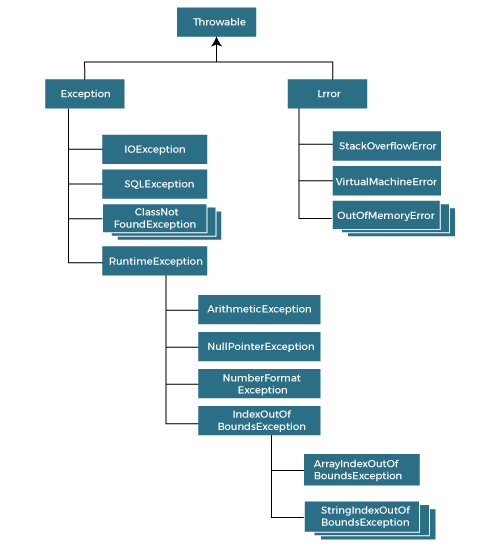

  

Hãy tưởng tượng vào một ngày đẹp trời, bạn quyết định tự lái xe từ Hà Nội đến Bắc Ninh để xem Spider-Man: No way home do Hà Nội chưa mở rạp chiếu phim. Tuy nhiên đang đi giữa đường thì bất ngờ xe của bạn bị thủng lốp. Sự kiện bất ngờ và không mong muốn này chính là ngoại lệ (exception)  

Tương tự, khi chúng ta tạo một chương trình Java và nó được biên dịch thành công, các ngoại lệ vẫn có thể xảy ra, phá vỡ luồng bình thường của một chương trình, thậm chí là chết chương trình.  

Trong bài viết này chúng ta sẽ cùng tìm hiểu ngoại lệ là gì và cách để xử lý chúng.  


# Ngoại lệ là gì?  
Ngoại lệ có nghĩa là một vấn đề hoặc một tình trạng bất thường khiến chương trình máy tính ngừng xử lý thông tin theo cách bình thường.   

Ngoại lệ trong Java là một đối tượng đại diện cho một lỗi hoặc một sự kiện bất ngờ xảy ra khi chương trình chạy và làm gián đoạn luồng thực thi bình thường của chương trình.    

Ví dụ: Khi chúng ta thực hiện chia một số cho 0 sẽ dẫn tới xảy ra ngoại lệ `ArithmeticException`. Hay khi cần nhập chiều cao và cân nặng để tính bmi, nhưng người dùng lại nhập chữ, cũng sẽ xảy ra ngoại lệ.

Vậy một ngoại lệ có thể xảy ra với nhiều lý do khác nhau, nó nằm ngoại dự tính của chương trình. Một vài lỗi là do người dùng, một vài lỗi lại bởi lập trình viên và số khác đến từ lỗi của nguồn dữ liệu vật lý, như:  
- Người dùng nhập dữ liệu không hợp lệ
- Không tìm thấy file để đọc  
- Mất kết nối mạng,...

## Hệ thống phân cấp của Exception

Lớp `java.lang.Throwable` là lớp gốc của hệ thống phân cấp ngoại lệ. Nó được kế thừa bởi 2 lớp con là `Exception` và `Error`. Xem hình dưới đây:  
  


## Các loại Exception trong Java  
Chủ yếu có 2 loại ngoại lệ: checked và unchecked. Mỗi error được coi là unchecked exception. Tuy nhiên, theo Oracle, có ba loại exception:  
- Checked Exception: Là loại exception xảy ra trong lúc compile time. Có thể kể đến như: `IOException`, `SQLException`,...
- Unchecked Exception: Các ngoại lệ không được kiểm tra tại thời điểm biên dịch, nhưng được kiểm tra trong thời gian chạy. Ví dụ như: `ArithmeticException`, `NullPointerException`, ...
- Error: Không thể khôi phục được. Như: `OutOfMemoryError`, `VirtualMachineError`,...

## Một số ngoại lệ phổ biến có thể xảy ra  
**Khi chia một số cho 0**  
```java
int number = 9;
int zero = 0;
int result = number/zero;  //ArithmeticException
```

**Thao tác với chuỗi rỗng**  
```java
String str = null;
System.out.println(str.length()); //NullPointerException
```

**Lỗi khi ép kiểu**  
```java
String str = "Chuỗi";
int number = Integer.parseInt(str); //NumberFormatException
```

**Thêm phần tử sai index trong mảng**  
```java
int []arr = new int[5];
arr[10] = 7; //ArrayIndexOutOfBoundsException
```

**Kích thước mảng là số âm**
```java
int[] arr = new int[-5]; //NegativeArraySizeException
```

<br>

# Xử lý ngoại lệ 

Java cung cấp 5 từ khóa sử dụng để xử lý ngoại lệ đó là:  

| Từ khóa | Mô tả |
| --- | --- |
| `try` | Sử dụng để chứa đoạn lệnh có thể gây ra ngoại lệ, nó phải được theo sau bởi khối `catch` hoặc `finally` |  
| `catch` | Sử dụng để xử lý ngoại lệ, các khối code để xử lý ngoại lệ sẽ được đặt trong đây |  
| `finally` | Sử dụng để thực thi đoạn mã cần thiết của chương trình. Khối này sẽ luôn được thực thi |  
| `throw` | Sử dụng để ném ra ngoại lệ |  
| `throws` | Sử dụng để khai báo ngoại lệ |  


## 1, Khối lệnh try-catch
Cú pháp:  
```java
try{
    //Khối lệnh có thể ném ra ngoại lệ
}catch(<Exception_class_name> e){
    //Code xử lý ngoại lệ
}
```

Ví dụ: Mình sẽ thử xử lý với trường hợp chia một số cho 0
```java
try{
    int number = 9;
    int zero = 0;
    int result = number/zero;  //ArithmeticException
    System.out.println(result);
}catch (ArithmeticException e){
    System.out.println(e.toString());
}
```
Kết quả:  
```
java.lang.ArithmeticException: / by zero
```

## 2, Khối try-finally
Cú pháp:  
```java
try{
    //Khối lệnh có thể ném ra ngoại lệ
}finally{
    //Khối lệnh trong đây luôn được thực thi
}
```

## 3, Khối try-catch-finally
Cú pháp:  
```java
try{
    //Khối lệnh có thể ném ra ngoại lệ
}catch(<Exception_class_name_1> e){
    //Code xử lý ngoại lệ 1
}catch(<Exception_class_name_2> e){
    //Code xử lý ngoại lệ 2
}finally{
    //Khối lệnh trong đây luôn được thực thi
}
```

## 4, Từ khóa throw
Từ khóa `throw` được sử dụng để ném ra ngoại lệ cụ thể. Thông thường nó được sử dụng với exception do người dùng tự định nghĩa  

Ví dụ:  
```java
System.out.println("Nhập tuổi của bạn:");
age = sc.nextInt();
//Tuổi không hợp lệ khi nhập số âm hoặc lớn hơn 200
if(age < 0 || age > 200) 
    throw new ArithmeticException("Tuổi không hợp lệ");
```

## 5, Từ khóa throws
Từ khóa `throws` sử dụng để khai báo ngoại lệ. Nó được sử dụng chủ yếu với checked exception  
Ví dụ: 

```java
public void readFile() throws IOException{ // Khai báo ngoại lệ

}
```

<br>

# Custom Exception  
Custom exception là ngoại lệ do người dùng tự định nghĩa, được sử dụng để tùy biến ngoại lệ theo yêu cầu của người dùng.   
Để tạo custom exception thuộc loại checked chúng ta kế thừa từ lớp `Exception`, còn với unchecked exception thì kế thừa từ lớp `RuntimeException`   

Ví dụ: Tạo custom exception loại checked  
```java
public class MyException extends Exception{
    public MyException(String message) {
        super(message);
    }
}
```


# Một số ví dụ xử lý ngoại lệ   

**Ví dụ 1**: Viết chương trình nhập tuổi từ bàn phím, kiểm tra đã đủ tuổi bầu cử chưa.  
Tuy nhiên khi thực hiện nhập dữ liệu vào từ bàn phím, có thể xảy ra trường hợp nhập chữ, hoặc tuổi là một số âm hoặc nhâp tuổi quá lớn. Do đó mình sẽ xử lý ngoại lệ với 3 trường hợp trên.  

```java
public class Main {

    public static void main(String[] args) {
        int age = getAge();
        if(age >= 18){
            System.out.println("Bạn đã đủ tuổi bầu cử");
        }else{
            System.out.println("Từ từ rồi sẽ đủ tuổi");
        }

    }

    public static int getAge(){
        Scanner sc = new Scanner(System.in);
        int age = 0;

        boolean isContinue = true;

        while(isContinue){ //Sử dụng vòng lặp để mỗi khi nhập sai sẽ yêu cầu nhập lại cho đến khi đúng
            try {
                System.out.println("Nhập tuổi của bạn:");
                age = Integer.parseInt(sc.nextLine());
                //Tuổi không hợp lệ khi nhập số âm hoặc lớn hơn 200
                if(age < 0 || age > 200) 
                    throw new ArithmeticException("Tuổi không hợp lệ"); //sử dụng throw để ném ra ngoại lệ
                isContinue = false;  //gán lại isContinue để dùng vòng lặp
            }catch (NumberFormatException e){ //Do có hai ngoại lệ có thể sảy ra nên sử dụng 2 khối catch để xử lý
                System.out.println("Tuổi phải là số");
            }catch (ArithmeticException e){
                System.out.println(e.getMessage());
            }
        }
        return age;
    }
}
```


**Ví dụ 2**: Viết chương trình nhập vào cân nặng và chiều cao, tính chỉ số bmi

