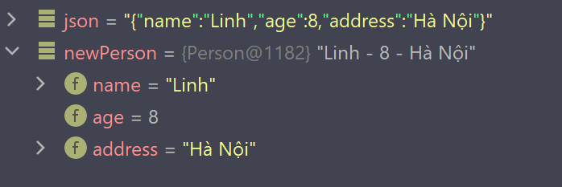

## Làm việc với Gson trong Java
Google Gson là một thư viện Java hỗ trợ xử lý JSON (Chuyển đổi một chuỗi JSON thành đối tượng Java hoặc ngược lại).  
Ngoài Gson cũng có rất nhiều thư viên khác hỗ trợ xử lý Json có thể kể đến như Json-simple, Jackson, json.org,... Tuy nhiên có một số lý do mà bạn nên sử dụng thư viện này:  
- Chuẩn hóa: Gson là thư viện chuẩn hóa do Google quản lý  
- Hiệu quả: Đây là một phần mở rộng đáng tin cậy, nhanh chóng và hiệu quả cho thư viện chuẩn Java
- Tối ưu hóa: Thư viện được tối ưu hóa cao
- Hỗ trợ Generics: Nó cung cấp hỗ trợ rộng rãi cho generics
- Hỗ trợ các class phức tạp: Nó hỗ trợ các đối tượng phức tạp với hệ thống phân cấp kế thừa sâu sắc

Giờ hãy cùng xem cách sử dụng thư viện này:

## Cài đặt thư viện Gson
Để cài đặt thư viên Gson chúng ta có các cách sau:  
- Sử dụng Maven:  
```
<!-- https://mvnrepository.com/artifact/com.google.code.gson/gson -->
<dependency>
    <groupId>com.google.code.gson</groupId>
    <artifactId>gson</artifactId>
    <version>2.9.0</version>
</dependency>
```

- Sử dụng Gradle:  
```
// https://mvnrepository.com/artifact/com.google.code.gson/gson
implementation group: 'com.google.code.gson', name: 'gson', version: '2.9.0'
```

## Chuyển đổi qua lại giữa JSON và Java Object
### Chuyển đổi từ Object sang Json

Ví dụ mình có class sau:  
```java
public class Person {
    private String name;
    private int age;
    private String address;

    public Person(String name, int age, String address) {
        this.name = name;
        this.age = age;
        this.address = address;
    }

    public String toString() {
        return name + " - " + age + " - " + address;
    }
}
```
Tiếp theo để có thể sử dụng các phương thức của Gson ta cần tạo đối tượng Gson. Để chuyển đổi một object sang JSON sử dụng phương thức `toJson()`

```java
import com.google.gson.Gson;

public class Main {
    public static void main(String[] args) {
        //Tạo đối tượng Gson
        Gson gson = new Gson();
        Person person = new Person("Ngọc", 5, "Hà Giang");

        //Chuyển đổi từ Object sang JSON
        String result = gson.toJson(person);
        System.out.println(result);
    }
}
```

Kết quả nhận được:
```
{"name":"Ngọc","age":5,"address":"Hà Giang"}
```  
<br>

### Chuyển đổi từ JSON thành Object

Để chuyển đổi từ JSON sang Object ta cũng cần tạo đối tượng Gson và sử dụng phương thức `fromJson()` để chuyển đổi
```java
import com.google.gson.Gson;

public class Main {
    public static void main(String[] args) {
        //Tạo đối tượng Gson
        Gson gson = new Gson();

        //Chuyển đổi từ JSON sang Object
        String json = "{\"name\":\"Linh\",\"age\":8,\"address\":\"Hà Nội\"}";
        Person newPerson = gson.fromJson(json, Person.class);
        System.out.println(newPerson);
    }
}
```

Kết quả:  
```
Linh - 8 - Hà Nội
```



## Chuyển đổi giữa JSON và mảng
### Chuyển đổi từ JSON sang mảng
Giả sử mình có một file JSON như sau:  
```json
[{
  "name": "Jimmy Buncom",
  "age": 30,
  "address": "Indonesia"
}, {
  "name": "Lucille Pollastrone",
  "age": 24,
  "address": "Poland"
}, {
  "name": "Hort Tall",
  "age": 15,
  "address": "Indonesia"
}, {
  "name": "Ruprecht Plampeyn",
  "age": 21,
  "address": "China"
}, {
  "name": "Erhard Liles",
  "age": 26,
  "address": "Dominican Republic"
}, {
  "name": "Fremont Murrow",
  "age": 20,
  "address": "North Korea"
}]
```  

```java
import com.google.gson.Gson;

import java.io.FileNotFoundException;
import java.io.FileReader;

public class Main {
    public static void main(String[] args) {

        //Tạo đối tượng Gson
        Gson gson = new Gson();

        //Chuyển đổi từ JSON sang mảng
        Person[] persons = null;
        try {
            FileReader reader = new FileReader("person.json");
            persons = gson.fromJson(reader, Person[].class);
        } catch (FileNotFoundException e) {
            e.printStackTrace();
        }

        for (Person p : persons){
            System.out.println(p);
        }
    }
}
```
Kết quả trả về:  
```
Jimmy Buncom - 30 - Indonesia
Lucille Pollastrone - 24 - Poland
Hort Tall - 15 - Indonesia
Ruprecht Plampeyn - 21 - China
Erhard Liles - 26 - Dominican Republic
```

### Chuyển đổi từ mảng sang JSON
```java
import com.google.gson.Gson;

public class Main {
    public static void main(String[] args) {

        //Tạo đối tượng Gson
        Gson gson = new Gson();

        //Chuyển đổi từ mảng sang JSON
        Person arr[] = new Person[5];
        arr[0] = new Person("John", 25, "American");
        arr[1] = new Person("Chris", 30, "France");
        arr[2] = new Person("Madeline", 19, "Colombia");
        arr[3] = new Person("Anna", 21, "Russia");
        arr[4] = new Person("Hoàng", 27, "Việt Nam");

        String rs = gson.toJson(arr);
        System.out.println(rs);
    }
}
```
Kết quả
```
[
  {"name": "John","age": 25,"address": "American"},
  {"name": "Chris","age": 30,"address": "France"},
  {"name": "Madeline","age": 19,"address": "Colombia"},
  {"name": "Anna","age": 21,"address": "Russia"},
  {"name": "Hoàng","age": 27,"address": "Việt Nam"}
]
```

<br>

## Chuyển đổi qua lại giữa JSON và Collection
Với Collection mình sẽ sử dụng ArrayList để thực hiện ví dụ. Mình vẫn sử dụng file JSON ban nãy

### Chuyển đổi từ JSON sang ArrayList
Để Gson hiểu được cấu trúc của ArrayList đó ta cần chỉ tới kiểu của nó. Thật may mắn khi Gson có một lớp để giúp ra tìm đúng kiểu dữ liệu đó là `TypeToken`

```java
import com.google.gson.Gson;
import com.google.gson.reflect.TypeToken;

import java.io.FileNotFoundException;
import java.io.FileReader;
import java.lang.reflect.Type;
import java.util.ArrayList;

public class Main {
    public static void main(String[] args) {

        //Tạo đối tượng Gson
        Gson gson = new Gson();

        //Chuyển đổi từ JSON sang ArrayList
        ArrayList<Person> list = new ArrayList<>();
        try {
            FileReader reader = new FileReader("person.json");
            Type type = new TypeToken<ArrayList<Person>>(){}.getType();
            list = gson.fromJson(reader, type);
        } catch (FileNotFoundException e) {
            e.printStackTrace();
        }

        for(Person p : list){
            System.out.println(p);
        }
    }
}
```
Kết quả:
```
Jimmy Buncom - 30 - Indonesia
Lucille Pollastrone - 24 - Poland
Hort Tall - 15 - Indonesia
Ruprecht Plampeyn - 21 - China
Erhard Liles - 26 - Dominican Republic
```

Còn đối với chuyển đổi từ ArrayList sang JSON thì cũng chỉ cần thực hiện tương tự như với chuyển đổi từ mảng sang JSON